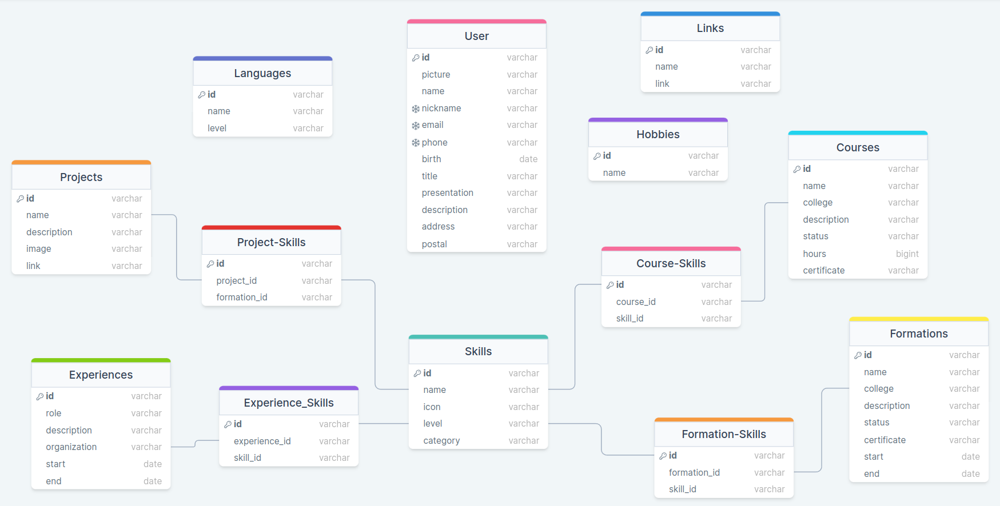
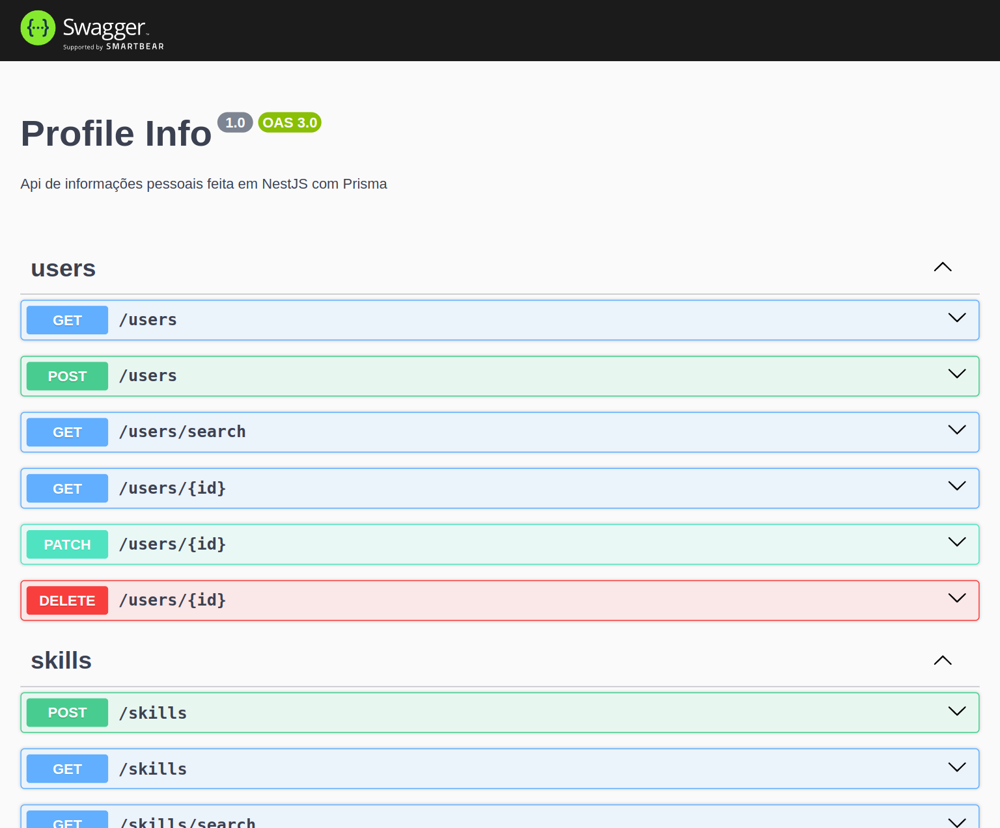

# [Profile Info](https://yagrrusso-info.onrender.com/swagger) 🚀

API for storing personal and professional information (single tenant)



## Running Swagger

[Run the app](#running-api) and open the link `localhost:8080/swagger` on your browser



## Installation

```bash
$ npm install
```

## Running API

```bash
# production mode
$ npm run start

# development mode
$ npm run start:dev

# dynamic mode
$ npm run start:repl
```

## Running Database

```bash
# migrate dev
$ npm run prisma:dev

# migrate deploy
$ npm run prisma:deploy

# prisma studio
$ npm run prisma:studio
```

## Test

```bash
# unit tests
$ npm run test

# watch tests
$ npm run test:watch

# e2e tests
$ npm run test:e2e

# test coverage
$ npm run test:cov
```

## Features

- [x] Development Patterns (Clean Code, Clean Architecture, SOLID, KISS, DRY and YAGNI)
- [x] Development Configs (Formatters, Code Patterns, ESLint, Prettier, TSConfig and Husky)
- [x] Repl
- [x] SQL Diagram
- [x] Prisma SQL Schema
- [x] Error Boundary
- [x] Docker (Postgres and Node)
- [x] Swagger
- [x] Open API
- [x] SDK Generator
- [x] Rest Routes
- [ ] Pagination
- [x] Authentication (JWT)
- [x] Roles (User and Admin)
- [x] Protected Routes and Queries (Public, Authenticated and By Role)
- [x] Multi Users (Protected)
- [x] Unit Tests
- [x] E2E Tests
- [x] [Deploy](https://yagrrusso-info.onrender.com/swagger) 🚀

## Resources Routes (Services, Controllers, Repositories, Entities, DTO, Protected Queries and more...)

- [x] App
- [x] Auth
- [x] Users
- [x] Skills
- [x] Projects
- [x] Formations
- [x] Courses
- [x] Experiences

## License

Nest is [MIT licensed](LICENSE).