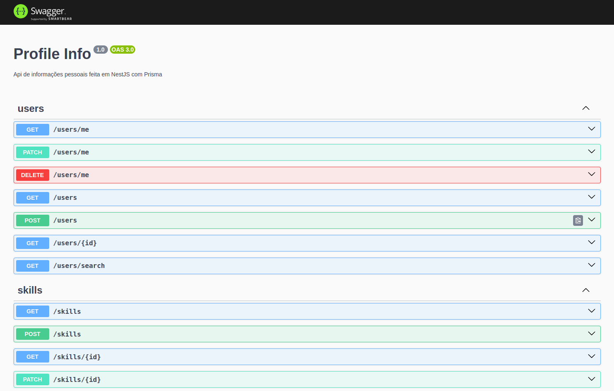

# [Profile Info](https://yagrrusso-info.onrender.com/swagger) 🚀

API for storing personal and professional information (single tenant)


## Running Swagger

[Run the app](#running-api) and open the link `localhost:8080/swagger` on your browser



## Installation

```bash
$ npm install
```

## Running API

```bash
# development
$ npm run start

# watch mode
$ npm run start:dev

# dynamic mode
$ npm run start:repl

# production mode
$ npm run start:prod
```

## Running Database

```bash
# migrate dev
$ npm run prisma:dev

# migrate deploy
$ npm run prisma:deploy

# prisma studio
$ npm run prisma:studio
```

## Test

```bash
# unit tests
$ npm run test

# watch tests
$ npm run test:watch

# e2e tests
$ npm run test:e2e

# test coverage
$ npm run test:cov
```

## Features

- [x] REST Routes
- [x] CRUD - Create, Read, Update and Delete
- [x] Interface/Types Patterns
- [x] ORM
- [x] Common Resources
- [x] Exception Filters
- [x] Code Formatters
- [x] Clean Code
- [x] Clean Architecture
- [x] Service Tests
- [x] Controller Tests
- [x] Repl
- [x] Swagger
- [x] SQLite Database
- [ ] PostgreSQL Database
- [ ] Docker Compose
- [ ] Auth JWT
- [ ] User Roles
- [ ] Protected Routes
- [ ] Protected Queries
- [ ] E2E Tests
- [ ] SWC Compiler
- [ ] CI/CD
- [x] Deploy 🚀

## License

Nest is [MIT licensed](LICENSE).